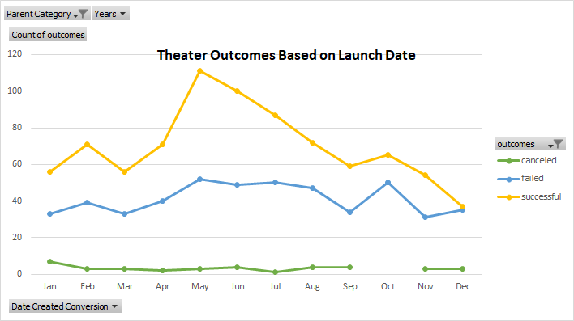
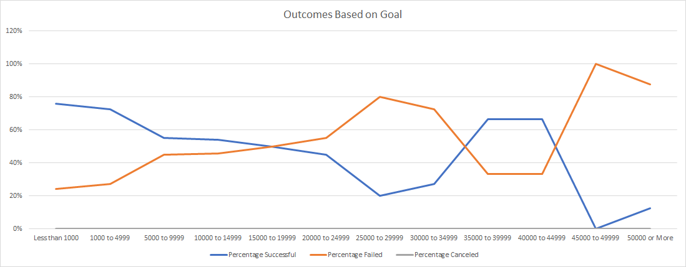

# Kickstarting with Excel

## Overview of Project

### Purpose
To show the relation between the outcome of a kickstarter play based on its goal and launch date
## Analysis and Challenges

### Analysis of Outcomes Based on Launch Date
May and June were the most successful months with over 100 successful kickstarters and no big difference in failed kickstarters. Never more than 10 canceled kickstarters a month, usually stays pretty consistent. September through January has the least successful kickstarters.

### Analysis of Outcomes Based on Goals
From 0-20000 and 35000-45000 there the number of successful kickstarters is greater than failed.Other than that there are more failed kickstarters than successful. No canceled kickstarter plays.

### Challenges and Difficulties Encountered

## Results

- What are two conclusions you can draw about the Outcomes based on Launch Date?
  - May and June are great months to launch, and avoid launching in November and December.

- What can you conclude about the Outcomes based on Goals?
  - Try to keep the goal under $20,000

- What are some limitations of this dataset?
  - Limited to the ~1000 data points.
- What are some other possible tables and/or graphs that we could create?
  - Outcomes based on years or country. Backer count based on goal.
